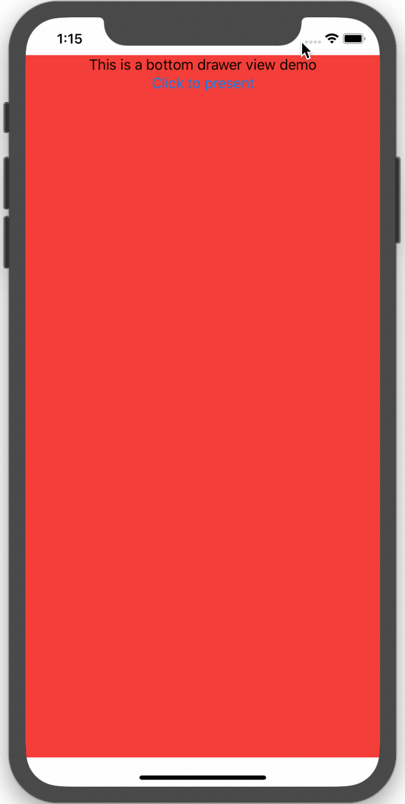
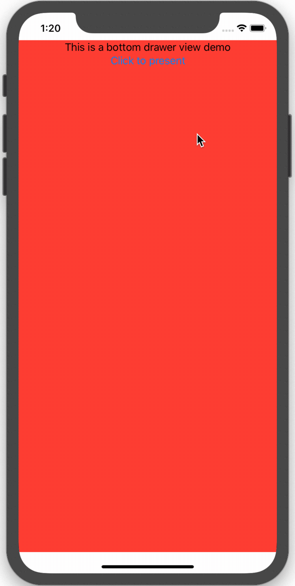
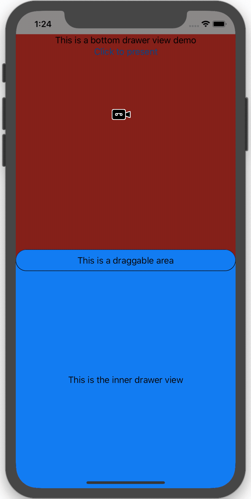

# DrawerView-SwiftUI

**Compatible with Xcode Beta 5 **

 **A drawer view implemented by SwiftUI. This is not just simply a demo, instead, it can be directly used in project as a module as it has rudimentary customization flexibility.**

## Introduction & Demo

### Basic Functionality Demo

*A drawer with some bouncing animation*




### Further Step

#### Click Anywhere of the Background to Dismiss DrawerView

You can click anywhere of the darken background to dismiss the DrawerView



#### Drag to Dismiss DrawerView

* You can drag the draggable area to dismiss the DrawerView

  

* However, if the translation of drag action is shorter than you want, you can still restore the DrawerView.

  

* Actually, you can even drag it up if you want. You can modify this behavior in the code.

  

## Usage

The entire `DrawerView` is coded in the file with the same name as `DrawerView.swift`. The setup code written in `Content.swift` which demonstrates how to use `DrawerView.swift`.

*`DrawerView` takes one required argument `isShow` to open and dismiss itself. You need to create one in your main view and bind it to `DrawerView`*

* Use `DrawerView` as `overlay`

  The code provided in the `Content.swift` uses `DrawerView` as a `overlay` of the main view.

  ``` swift
  VStack {
    // Create your own main view
  }
  .overlay(DrawerView(isShow: $isShow))
  ```

* Use `DrawerView` in `ZStack`

  ``` swift
  ZStack {
    VStack {
      // Create your own main view
    }
    
    DrawerView(isShow: $isShow)
  }
  ```

## Customization

*All customizable properties have provided in the `DrawerView.swift`. You can directly assign the preferred value to these variables when you initialize the `DrawerView`*

* `backLayerColor`

* `backLayerOpacity`

* `backLayerAnimation`

* `drawerOrientation`

* `drawerHeight`

* `drawerWidth`

* `drawerCornerRadius`

* `drawerBackgroundColor`

* `drawerOutAnimation`

* `isDrawerShadowEnable`

* `drawerShadowRadius` 

  *If you want to customize this property, you need to set `isDrawerShadowEnable` to `true` first. By default, the animation of shadow is suppressed, but you can change it in source file.*

* **To Be Continued**

## Contribution

This project is for demonstration purpose. Any contribution is welcome!

**Best Luck and Happy Coding!**

